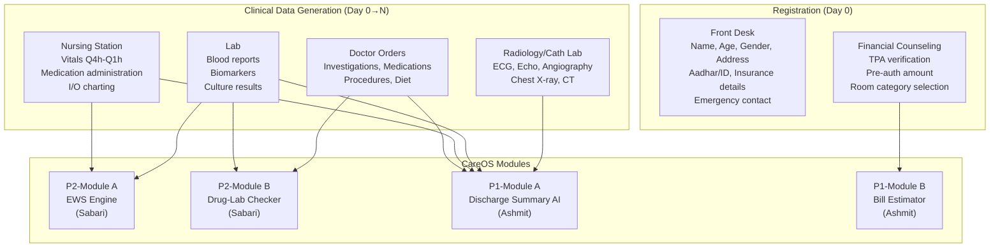
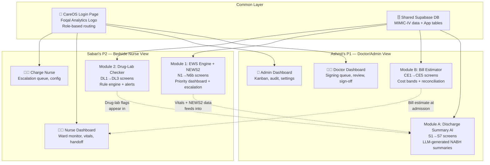
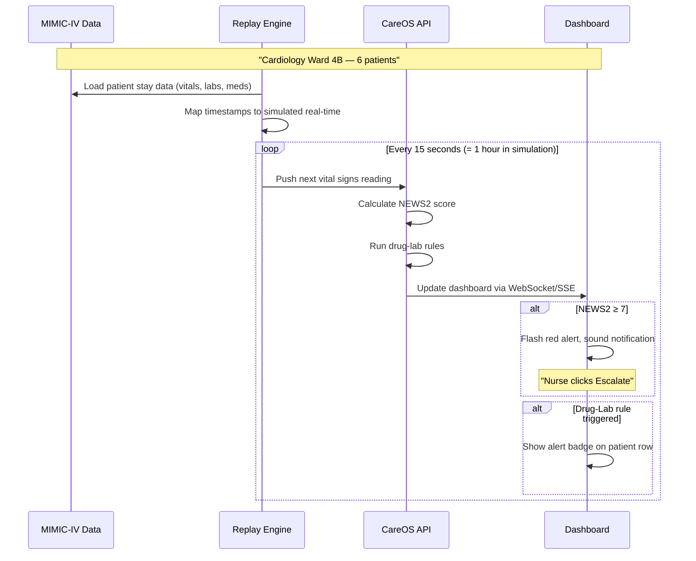

# CareOS Ecosystem — Complete Research & Integration Plan

> **Goal**: Transform our project from "basic-level" to a production-grade, medically-grounded clinical decision support system that mimics how an Indian hospital actually works, demonstrated with MIMIC-IV data, and integrated with Ashmit's project into a unified CareOS ecosystem.

> [!IMPORTANT]
> **Thursday Presentation Focus**: You should be able to explain every medical term, every workflow, every data source, and every role's responsibility to Dr. Shroff without any gaps.

---

## 1. How an Indian Private Hospital Actually Works

### 1.1 The Complete Patient Journey (Cardiology)

```mermaid
flowchart LR
    A["🏥 OPD Visit\nSymptoms + Vitals"] --> B["🩺 Cardiologist\nConsultation"]
    B --> C["🧪 Diagnostics\nECG, Echo, Blood"]
    C --> D{"Decision\nPoint"}
    D -->|Medical Mgmt| E["💊 OPD Follow-up\nMedications"]
    D -->|Admission| F["📋 Registration\nDemographics + Insurance"]
    F --> G["💰 Financial Counseling\nTPA/Insurance Pre-auth"]
    G --> H["🏨 Ward Admission\nBed Assignment"]
    H --> I["📊 MODULE B: Bill Estimator\nCE1→CE3"]
    I --> J["🔬 Treatment Phase\nProcedures + Monitoring"]
    J --> K["👩‍⚕️ MODULE A: Ward Monitor\nNEWS2 + Drug-Lab"]
    K --> L{"Deterioration?"}
    L -->|Yes| M["🚨 Escalation\nHigher Care / ICU"]
    M --> K
    L -->|No| N["✅ Recovery\nStable Vitals"]
    N --> O["📝 MODULE A: Discharge Summary\nP1 - Ashmit's Project"]
    O --> P["💰 MODULE B: Reconciliation\nCE4→CE5 Final Bill"]
    P --> Q["🚪 Discharge\nGate Pass"]
```



### 1.2 Indian Hospital Structure — The Real Picture

| Layer | Roles | What They Actually Do |
|:------|:------|:---------------------|
| **Administration** | Hospital Director, Medical Superintendent | Overall governance, NABH compliance, budget |
| **Department Head** | HOD Cardiology, CMO | Clinical protocol approval, quality oversight |
| **Consultants** | Senior Cardiologist (Attending) | Primary clinical decisions, procedures, sign-offs |
| **Residents** | Junior Doctor, Registrar | Day-to-day patient management, documentation |
| **Nursing Leadership** | Nursing Superintendent, Ward Sister | Policy, scheduling, quality |
| **Charge Nurse** | Shift leader per ward | Oversees all nurses on duty, escalation oversight |
| **Bedside Nurse** | Staff Nurse (GNM/BSc) | **Primary user** — vitals, meds, bedside care |
| **Support** | Billing staff, Lab technician, Pharmacist | Financial, diagnostic, medication support |

### 1.3 How Data Flows in an Indian Hospital



---

## 2. Cardiology Department Deep-Dive

### 2.1 Why Cardiology? — The Indian Context

- **CVD is India's #1 killer** — 28.1% of all deaths (ICMR 2023)
- Indians develop heart disease **10-15 years earlier** than Western populations
- High prevalence of **diabetes + hypertension** as co-morbidities
- **Rheumatic heart disease** still significant in rural India
- Hospital cardiology wards are always at **high occupancy** — perfect use case for our monitoring system

### 2.2 Narrowing Down: Cardiology → Heart Failure → Dilated Cardiomyopathy (DCM)

> [!TIP]
> We narrow to DCM because: (a) it's the most data-rich condition in MIMIC-IV, (b) it has a clear multi-day hospital stay with vitals trends, (c) it involves multiple drug classes that trigger drug-lab rules, (d) NEWS2 deterioration patterns are well-documented.

#### What is Dilated Cardiomyopathy (DCM)?
- **Definition**: The left ventricle becomes enlarged and weakened, unable to pump blood effectively
- **ICD-10 Code**: I42.0
- **Ejection Fraction (EF)**: Normally 55-70%, DCM patients typically 15-35%
- **NYHA Classification** (severity of heart failure symptoms):

| Class | Description | Patient Experience |
|:------|:-----------|:-------------------|
| **I** | No limitation | Normal daily activity, no breathlessness |
| **II** | Slight limitation | Comfortable at rest, ordinary activity causes breathlessness |
| **III** | Marked limitation | Comfortable at rest, less-than-ordinary activity causes symptoms |
| **IV** | Unable to carry out any physical activity | Symptoms at rest, bed-bound |

#### Common Cardiology Conditions We Cover

| Condition | ICD-10 | Key Vitals Pattern | Drug-Lab Risks |
|:----------|:-------|:-------------------|:---------------|
| **Dilated Cardiomyopathy** | I42.0 | ↓BP, ↑HR, ↓SpO2, ↑RR | ACEi+K⁺, Warfarin+Aspirin, Furosemide+K⁺ |
| **STEMI** | I21.0-I21.3 | ↓BP, ↑HR, pain, ↑Troponin | Heparin+NSAID, Clopidogrel+Omeprazole |
| **NSTEMI** | I21.4 | Variable BP, ↑HR, ↑Troponin | Dual antiplatelet risks |
| **Congestive Heart Failure** | I50.x | ↑RR, ↓SpO2, ↓BP, oedema | Diuretic electrolyte loss |
| **Atrial Fibrillation** | I48.x | Irregular HR, variable BP | Anticoagulant bleeding risk |
| **Complete Heart Block** | I44.2 | ↓HR (<40), ↓BP | β-blocker contraindication |

### 2.3 The "Four Pillars" of Heart Failure Treatment (HFrEF)

This is critical to understand because these drugs ARE the ones that trigger our drug-lab rules:

| Pillar | Drug Class | Example | Why It Matters for Us |
|:-------|:----------|:--------|:---------------------|
| **1. ARNI/ACEI/ARB** | Angiotensin system blocker | Ramipril, Sacubitril-Valsartan | Can cause **hyperkalemia** (K⁺ ↑) and **renal dysfunction** |
| **2. Beta-blocker** | Heart rate control | Carvedilol, Metoprolol, Bisoprolol | Can cause **bradycardia** and **hypotension** |
| **3. MRA** | Aldosterone antagonist | Spironolactone, Eplerenone | Worsens **hyperkalemia** risk, especially with ACEI |
| **4. SGLT2 inhibitor** | Newer diabetes/HF drug | Empagliflozin, Dapagliflozin | Can cause **volume depletion** and **UTI** |

**Additional common drugs in DCM patients:**
- **Furosemide** (loop diuretic) — causes **hypokalemia** and **hyponatremia**
- **Warfarin** (anticoagulant) — needs INR monitoring, interacts with almost everything
- **Digoxin** — narrow therapeutic window, toxicity if K⁺ is low
- **Amiodarone** — for arrhythmias, interacts with Warfarin, causes thyroid/liver issues

### 2.4 Key Biomarkers the Nurse and Doctor Monitor

| Biomarker | Normal Range | What It Tells | Alert Threshold |
|:----------|:------------|:-------------|:----------------|
| **BNP** | <100 pg/mL | Heart failure severity | >400 = severe HF |
| **NT-proBNP** | <300 pg/mL | Heart failure (more accurate) | >900 = significant HF |
| **Troponin I** | <0.04 μg/L | Heart muscle damage | >0.4 = myocardial injury |
| **Creatinine** | 0.7-1.3 mg/dL | Kidney function | >1.5 = renal impairment |
| **eGFR** | >90 mL/min | Kidney filtration rate | <30 = severe CKD |
| **Potassium (K⁺)** | 3.5-5.0 mEq/L | Electrolyte balance | <3.0 or >5.5 = dangerous |
| **INR** | 2.0-3.0 (on warfarin) | Clotting time | >3.5 = bleeding risk |
| **Lactate** | <2.0 mmol/L | Tissue oxygenation | >4.0 = severe hypoperfusion |
| **Sodium (Na⁺)** | 135-145 mEq/L | Fluid balance | <130 = hyponatremia |

---

## 3. The Nurse Perspective — Why Our System Matters

> [!CAUTION]
> **This is the most critical section**. The owner specifically said "think from a nurse perspective." Every feature decision must pass the test: "Does this make the bedside nurse's life easier?"

### 3.1 A Day in the Life of an Indian Bedside Nurse (Cardiology Ward)

**06:45** — Arrives, gets shift handoff from night nurse
**07:00** — Starts rounds: checks all 6-8 assigned patients
**07:15** — Records vitals (BP, HR, SpO₂, RR, Temp) on paper/EMR for each patient
**07:30** — Medication rounds (morning doses)
**08:00** — Doctor rounds — accompanies consultant, notes new orders
**08:30** — Implements new orders: changes IV drips, sends samples to lab
**09:00-10:00** — Procedures: ECG monitoring, wound care, patient education
**10:00** — Second vital signs recording
**10:30-12:00** — Documentation, charting, responding to call bells
**12:00** — Lunch break (staggered)
**13:00** — Afternoon vitals + medication round
**14:00-16:00** — Monitoring, lab result follow-up, family education
**16:00** — Vitals recording again
**18:00** — Evening medication round
**18:45** — Shift handoff preparation
**19:00** — Handoff to night nurse

### 3.2 The Nurse's Pain Points (What CareOS Solves)

| Pain Point | Current Reality | CareOS Solution |
|:-----------|:---------------|:----------------|
| **"I missed a deterioration"** | Vitals on paper, trends not visible at a glance | Real-time NEWS2 dashboard with color-coded risk, sorted by acuity |
| **"I didn't know the BP was trending down"** | Static numbers, no trend analysis | 6-hour sparkline charts showing trajectory |
| **"Should I escalate or wait?"** | Subjective judgment under time pressure | NEWS2 score + ML risk prediction + clear escalation protocol |
| **"I forgot about the drug interaction"** | Pharmacist reviews happen once daily | Real-time drug-lab alerts with plain-English explanations |
| **"The shift handoff was incomplete"** | Verbal handoff, things get missed | Structured digital handoff with patient priority notes |
| **"I can't reach the doctor"** | Phone calls, paging, no audit trail | One-click escalation with automatic notification + audit trail |
| **"I have to recalculate NEWS2 manually"** | Error-prone manual calculation | Auto-calculated from entered/monitored vitals |
| **"I'm monitoring 8 patients on paper"** | Can't prioritize effectively | Priority dashboard — sickest patient always on top |

### 3.3 The SBAR Communication Framework (Used in Escalation)

When our nurse escalates via CareOS, the system auto-generates an SBAR format message:

| Component | What It Contains | Our System Generates |
|:----------|:----------------|:--------------------|
| **S**ituation | What's happening right now | "PT-24-0092 Priya Sharma, NEWS2 9 (CRITICAL)" |
| **B**ackground | Clinical context | "45F, STEMI post-PCI Day 2, Heparin infusion" |
| **A**ssessment | Nurse's assessment | "SpO₂ 91%, BP 88/52, trending down over 2hrs" |
| **R**ecommendation | What you're asking for | "Urgent bedside assessment, consider ICU transfer" |

---

## 4. NEWS2 — Complete Technical Reference

### 4.1 NEWS2 Scoring Chart (Exact Parameters)

| Score | 3 | 2 | 1 | 0 | 1 | 2 | 3 |
|:------|:--|:--|:--|:--|:--|:--|:--|
| **RR** | ≤8 | | 9-11 | 12-20 | | 21-24 | ≥25 |
| **SpO₂ Scale 1** | ≤91 | 92-93 | 94-95 | ≥96 | | | |
| **SpO₂ Scale 2** | ≤83 | 84-85 | 86-87 | 88-92 | 93-94 on O₂ | 95-96 on O₂ | ≥97 on O₂ |
| **Supplemental O₂** | | Yes (+2) | | Air (0) | | | |
| **Systolic BP** | ≤90 | 91-100 | 101-110 | 111-219 | | | ≥220 |
| **Heart Rate** | ≤40 | | 41-50 | 51-90 | 91-110 | 111-130 | ≥131 |
| **Consciousness** | | | | Alert | | | C, V, P, or U |
| **Temperature** | ≤35.0 | | 35.1-36.0 | 36.1-38.0 | 38.1-39.0 | ≥39.1 | |

### 4.2 Clinical Response Protocol

| Total Score | Risk Level | Clinical Response | Monitoring Frequency |
|:-----------|:-----------|:------------------|:---------------------|
| **0** | Low | Continue routine monitoring | Every 12 hours minimum |
| **1-4** | Low | Nurse decides on frequency | Every 4-6 hours |
| **3 in any single param** | Low-Medium | Urgent ward-based doctor review | Every 1 hour minimum |
| **5-6** | Medium | Urgent assessment by senior clinician | Continuous or every 30 min |
| **≥7** | High | Emergency assessment by critical care team | **Continuous monitoring** |

> [!WARNING]
> **Indian Calibration**: Standard NEWS2 thresholds are validated on UK populations. For Indian patients: (a) SBP ≥220 mmHg should score 3 (hypertensive crisis — more common in Indian populations per CSI guidelines), (b) SpO₂ thresholds may need adjustment for patients at altitude or with chronic lung disease. Our API already handles this.

---

## 5. Secondary Clinical Criteria We Monitor

### 5.1 Sepsis-3 / qSOFA (Quick Sequential Organ Failure Assessment)

**qSOFA Score** — bedside screening for sepsis (each = 1 point):
- Respiratory Rate ≥ 22/min
- Altered mentation (GCS < 15)  
- Systolic BP ≤ 100 mmHg

**qSOFA ≥ 2 = suspect sepsis → trigger SOFA assessment**

**Septic Shock Definition**:
- Requires vasopressors to maintain MAP ≥ 65 mmHg, AND
- Serum lactate > 2.0 mmol/L despite adequate fluid resuscitation

### 5.2 KDIGO AKI (Acute Kidney Injury) Staging

| Stage | Creatinine Criteria | Urine Output |
|:------|:-------------------|:-------------|
| **1** | ↑ ≥0.3 mg/dL within 48h OR 1.5-1.9× baseline | <0.5 mL/kg/h for 6-12h |
| **2** | 2.0-2.9× baseline | <0.5 mL/kg/h for ≥12h |
| **3** | ≥3.0× baseline OR ≥4.0 mg/dL OR renal replacement therapy | <0.3 mL/kg/h for ≥24h OR anuria ≥12h |

> [!NOTE]
> AKI is particularly relevant for our cardiology patients because: (a) Heart failure causes poor kidney perfusion, (b) Diuretics (furosemide) can worsen renal function, (c) ACE inhibitors can cause acute creatinine rise, (d) Contrast dye from angiography causes contrast-induced nephropathy.

---

## 6. MIMIC-IV Data — Complete Mapping for Our System

### 6.1 What MIMIC-IV Contains

MIMIC-IV is a de-identified ICU database from Beth Israel Deaconess Medical Center (Boston), containing data for **~73,000 ICU stays** across **2008-2019**.

| Module | Tables We Use | What We Get |
|:-------|:-------------|:-----------|
| **hosp** | `patients`, `admissions`, `diagnoses_icd`, `labevents`, `prescriptions`, `d_labitems` | Demographics, diagnoses, labs, medications |
| **icu** | `icustays`, `chartevents`, `d_items`, `inputevents`, `outputevents` | Vitals, IV drugs, urine output |

### 6.2 Vital Signs Item IDs (chartevents → d_items)

| Vital Sign | `itemid` | `d_items.label` | Unit |
|:-----------|:---------|:----------------|:-----|
| Heart Rate | 220045 | Heart Rate | bpm |
| Systolic BP (Non-invasive) | 220179 | Non Invasive Blood Pressure systolic | mmHg |
| Diastolic BP (Non-invasive) | 220180 | Non Invasive Blood Pressure diastolic | mmHg |
| Mean Arterial Pressure (Non-invasive) | 220181 | Non Invasive Blood Pressure mean | mmHg |
| Systolic BP (Arterial line) | 220050 | Arterial Blood Pressure systolic | mmHg |
| Diastolic BP (Arterial line) | 220051 | Arterial Blood Pressure diastolic | mmHg |
| Respiratory Rate | 220210 | Respiratory Rate | insp/min |
| Respiratory Rate (set) | 224690 | Respiratory Rate (Set) | insp/min |
| SpO₂ | 220277 | O2 saturation pulseoxymetry | % |
| Temperature (°F) | 223761 | Temperature Fahrenheit | °F |
| Temperature (°C) | 223762 | Temperature Celsius | °C |
| GCS Total | 220739 | GCS - Eye Opening + Verbal + Motor | -- |
| FiO₂ (set) | 223835 | Inspired O2 Fraction | % |

### 6.3 Lab Item IDs (labevents → d_labitems)

| Lab Test | `itemid` | Clinical Use |
|:---------|:---------|:-------------|
| Potassium (Blood) | 50971 | Electrolyte monitoring, drug-lab rules |
| Creatinine | 50912 | Kidney function, AKI detection |
| Lactate | 50813 | Sepsis/perfusion marker |
| INR | 51237 | Anticoagulation monitoring |
| Troponin T | 51003 | Cardiac injury marker |
| BNP | 50963 | Heart failure severity |
| Sodium | 50983 | Fluid balance |
| Hemoglobin | 51222 | Anemia, bleeding detection |
| WBC Count | 51301 | Infection marker |
| Glucose | 50931 | Diabetes management |
| Bilirubin (Total) | 50885 | Liver function |
| Platelet Count | 51265 | Clotting, sepsis marker |

### 6.4 How We Filter for Cardiology Patients

```sql
-- Get cardiology ICU patients from MIMIC-IV
SELECT DISTINCT a.hadm_id, a.subject_id
FROM admissions a
JOIN diagnoses_icd d ON a.hadm_id = d.hadm_id
WHERE d.icd_code IN (
    -- Dilated Cardiomyopathy
    'I420', '4254',
    -- Heart Failure
    'I500', 'I501', 'I509', '4280', '4281',
    -- STEMI
    'I210', 'I211', 'I212', 'I213', '41071',
    -- NSTEMI
    'I214', '41071',
    -- Atrial Fibrillation
    'I480', 'I481', 'I482', '42731',
    -- Heart Block
    'I442', '4260'
)
AND a.hadm_id IN (SELECT hadm_id FROM icustays);
```

### 6.5 MIMIC-IV Data → CareOS Module Mapping

| CareOS Feature | MIMIC Source | Transformation |
|:--------------|:------------|:---------------|
| **Patient Demographics** | `patients` + `admissions` | age = anchor_age + (admittime_year - anchor_year) |
| **NEWS2 Dashboard** | `chartevents` (vitals) | Filter by vital itemIDs → calculate NEWS2 score |
| **Vital Trend Sparklines** | `chartevents` ordered by charttime | Last 24h of HR, RR, SpO₂, BP, Temp → array for chart |
| **Drug-Lab Alerts** | `prescriptions` + `labevents` | Cross-reference active meds vs latest lab values |
| **AKI Detection** | `labevents` (creatinine series) | Compare baseline vs current creatinine → KDIGO staging |
| **Sepsis Screening** | `chartevents` (vitals) + `labevents` (lactate) | qSOFA from vitals + lactate trend |
| **Discharge Summary** | `noteevents` + `diagnoses_icd` + `procedures_icd` + `labevents` + `prescriptions` | Ashmit's LLM generates summary from clinical data |
| **Bill Estimator** | `admissions` (LOS) + `procedures_icd` + `prescriptions` | Cost model based on procedures + LOS + medications |

---

## 7. The CareOS Ecosystem — Integration Plan

### 7.1 Unified Architecture



### 7.2 Common Login Page Design

The login page should show:
- **Foqal Analytics** logo (top)
- **CareOS** branding — "Clinical Decision Support Platform"
- **Hospital Name**: Configurable (e.g., "Apollo Hospitals, Chennai")
- **Role Selection**: Auto-routing based on credentials

| Role | Login Redirects To | Project Owner |
|:-----|:------------------|:-------------|
| Doctor (Attending) | Doctor Dashboard → Signing Queue (S4a) | Ashmit (P1) |
| Admin Staff | Admin Queue → Data Ingestion | Ashmit (P1) |
| Bedside Nurse | NEWS2 Priority Dashboard (N1) | **Sabari (P2)** |
| Charge Nurse | Escalation Queue (N5) | **Sabari (P2)** |
| Billing Staff | Cost Estimator (CE1) | Ashmit (P1) |
| Ward Admin | Kanban Pipeline (A1) | Ashmit (P1) |
| Super Admin | User Management (SA1) | Shared |
| CMO | CMO Dashboard | Shared |

### 7.3 Data Flow Between P1 and P2

| From P2 (Sabari) → To P1 (Ashmit) | Data | Purpose |
|:-----------------------------------|:-----|:--------|
| NEWS2 scores over admission | All vitals + scores | Feeds §4 (Clinical Examination) and §9 (Progress Notes) in discharge summary |
| Drug-Lab alerts | Alert history + actions taken | Feeds §7 (Treatment & Medications) and §15 (Complications) |
| Escalation events | Timeline of escalations | Feeds §9 (Progress Notes) and §15 (Complications) |
| Shift handoff notes | Nursing observations | Feeds clinical context for LLM summary generation |

| From P1 (Ashmit) → To P2 (Sabari) | Data | Purpose |
|:-----------------------------------|:-----|:--------|
| Patient demographics | Name, age, diagnosis, ward | Patient header in nurse dashboard |
| Active prescriptions | Drug names, doses, frequencies | Drug-lab rule engine input |
| Diagnosis codes | ICD-10 codes | Condition-specific alert thresholds |
| Bill estimate status | Pending/complete | Nurse awareness of billing status |

---

## 8. The Real-Time Hospital Simulator

### 8.1 Concept

We build a **MIMIC-IV replay engine** that simulates a live hospital ward:



### 8.2 How the Simulator Works

1. **Select 4-6 cardiology patients** from MIMIC-IV with interesting deterioration patterns
2. **Time-compress**: 1 hour of real hospital time = 15 seconds of simulation
3. **Replay their actual chartevents** in chronological order
4. As vitals change, NEWS2 recalculates in real-time
5. The demo shows: a patient starts stable → gradually deteriorates → nurse gets alerted → escalation → doctor intervenes → patient stabilizes

### 8.3 Demo Scenario for Thursday

**Patient: "Rajesh Kumar" (mapped from MIMIC subject)**

| Time (Simulated) | Event | NEWS2 | Status |
|:-----------------|:------|:------|:-------|
| Day 1, 08:00 | Admitted, stable vitals | 2 | 🟢 Low |
| Day 1, 14:00 | HR rising to 100, RR 20 | 3 | 🟡 Watch |
| Day 2, 02:00 | SpO₂ drops to 93%, BP 100/65 | 5 | 🟠 Medium |
| Day 2, 06:00 | **Drug-Lab Alert**: K⁺ 3.1 + Furosemide | 5 + DL | 🟠 Medium + Alert |
| Day 2, 10:00 | SpO₂ 91%, RR 24, BP 88/55 | **8** | 🔴 **CRITICAL** |
| Day 2, 10:01 | **Nurse escalates via CareOS** | 8 | 🔴 Escalated |
| Day 2, 10:15 | Doctor arrives, IV Furosemide, O₂ | 8→6 | 🟠 Improving |
| Day 2, 14:00 | Vitals stabilize | 3 | 🟡 Resolved |
| Day 3 | Recovery, discharge planning | 1 | 🟢 Stable |

---

## 9. Drug-Lab Interaction Rules — Complete Library

### 9.1 Cardiology-Specific Rules (13 Rules)

| ID | Trigger Condition | Alert Message | Severity | Clinical Action | Evidence |
|:---|:-----------------|:-------------|:---------|:---------------|:---------|
| R-001 | Warfarin + Aspirin co-prescribed | Dual antithrombotic — HIGH bleeding risk | T1 CRITICAL | Hold one agent + Charge Nurse co-sign | ESC HF Guidelines 2023 |
| R-002 | Digoxin + K⁺ < 3.0 mEq/L | Digitalis toxicity risk — low potassium | T1 CRITICAL | Alert attending immediately, IV K⁺ replacement | ACC/AHA 2022 |
| R-003 | ACE inhibitor + K⁺ > 5.5 mEq/L | Hyperkalemia risk — hold dose | T1 CRITICAL | Hold ACEI, check K⁺ in 4h, ECG monitoring | KDIGO 2021 |
| R-004 | Heparin + NSAID | Bleeding risk — GI and procedural | T1 CRITICAL | Hold NSAID, monitor for bleeding signs | ACCP 2022 |
| R-005 | Metformin + eGFR < 30 | Lactic acidosis risk | T1 CRITICAL | Stop metformin, check lactate | ICMR Diabetes Guidelines |
| R-006 | β-blocker + Verapamil | Heart block risk | T1 CRITICAL | ECG monitoring, hold one agent | ESC Arrhythmia 2023 |
| R-007 | Haloperidol + QTc > 460ms | Torsades de Pointes risk | T1 CRITICAL | Hold haloperidol, ECG monitoring | FDA Black Box Warning |
| R-008 | Metformin + Contrast dye | Contrast-induced nephropathy + lactic acidosis | T1 CRITICAL | Hold metformin 48h pre/post contrast | ACR 2022 |
| R-009 | Troponin > 0.4 μg/L (any) | Myocardial injury detected | T1 CRITICAL | STEMI protocol — activate cath lab | CSI STEMI India Protocol |
| R-010 | Furosemide + K⁺ < 3.2 mEq/L | Hypokalemia risk — arrhythmia | T2 MAJOR | K⁺ replacement 40 mEq/day | WHO Essential Medicines |
| R-011 | Statin + Amiodarone | Myopathy/rhabdomyolysis risk | T2 MAJOR | CK monitoring weekly | FDA Drug Safety |
| R-012 | Clopidogrel + Omeprazole | CYP2C19 interaction — reduced antiplatelet | T2 MAJOR | Switch to pantoprazole | FDA Drug Interaction |
| R-013 | Vancomycin + Creatinine > 1.5 | Nephrotoxicity risk | T2 MAJOR | Renal dose adjustment, trough monitoring | ASHP 2020 |

---

## 10. Roles in Our CareOS Ecosystem

### 10.1 Detailed Role Responsibilities

#### 👩‍⚕️ Bedside Nurse (PRIMARY USER — Sabari's P2)
- **Monitors** 6-8 patients simultaneously from the nursing station
- **Records vitals** every 1-6 hours depending on acuity
- **Views** NEWS2 priority dashboard → sickest patient always on top
- **Receives** drug-lab awareness alerts (can't action, but monitors for signs)
- **Escalates** to doctor when NEWS2 ≥ 5 or any single parameter scores 3
- **Documents** shift handoff with patient summaries and pending tasks
- **Does NOT** override drug-lab rules (that's the doctor's role)

#### 👩‍⚕️ Charge Nurse (Sabari's P2)
- **Oversees** all escalations across the ward (N5 queue)
- **Configures** ward-level NEWS2 thresholds (N5b)
- **Co-signs** T1 drug-lab overrides when doctor overrides a critical rule
- **Re-escalates** if doctor hasn't responded within SLA time

#### 🩺 Attending Doctor (Ashmit's P1)
- **Reviews** discharge summaries generated by AI (S4a→S4b)
- **Actions** drug-lab flags: override (with justification), hold medication, or consult
- **Signs** discharge summaries with digital signature (S5)
- **Responds** to nurse escalations

#### 👔 Admin Staff (Ashmit's P1)
- **Registers** patients, enters demographics
- **Ingests** clinical data from hospital systems
- **Manages** the documentation pipeline (Kanban board)

#### 💰 Billing Staff (Ashmit's P1)
- **Creates** cost estimates at admission (CE1)
- **Reconciles** actual vs estimated costs at discharge (CE4)
- **Generates** final bills (CE5)

---

## 11. NABH Compliance Points We Address

| NABH Standard | Our Implementation |
|:-------------|:------------------|
| **Patient Rights** | DPDPA 2023 consent gate before any data processing |
| **Care of Patients** | NEWS2 early warning with documented escalation protocol |
| **Management of Medication** | Drug-lab interaction checker with 13 auditable rules |
| **Patient Safety** | Automated deterioration detection, structured handoffs |
| **Continuous Quality Improvement** | CMO dashboard with accuracy metrics, audit logs |
| **Information Management** | Complete audit trail, version control on summaries |
| **Nursing Care** | Shift handoff documentation, ward-level threshold config |

---

## 12. Proposed Changes — What We Build

### P2 Backend (ward-monitor-api)

#### [MODIFY] [main.py](file:///e:/IP_EarlyWarning/EWS-CDS/ward-monitor-api/main.py)
- Add WebSocket endpoint for real-time vitals push
- Add MIMIC-IV replay engine endpoint (`/api/simulator/start`, `/api/simulator/stop`)
- Add escalation endpoints (`/api/escalations`, `/api/escalations/{id}/acknowledge`)
- Add shift handoff endpoints (`/api/handoffs`)
- Add Sepsis-3/qSOFA and KDIGO AKI calculation endpoints

#### [NEW] `simulator.py`
- MIMIC-IV time-series replay engine
- Select cardiology patients by ICD code
- Time-compress and stream vitals via WebSocket

#### [NEW] `escalation.py`
- Escalation model, SBAR auto-generation
- Escalation lifecycle: created → acknowledged → resolved

---

### P2 Frontend (vanilla-frontend or new unified frontend)

#### [NEW] `login.html` — Common CareOS Login
- Foqal Analytics logo + CareOS branding
- Role-based routing to P1 or P2 views

#### [MODIFY] Ward Monitor Dashboard
- Enhance with MIMIC replay controls
- Add Sepsis-3 / AKI secondary panels
- Add shift handoff screen
- Add escalation form and status log

---

### Integration Layer

#### [NEW] Shared API Gateway or proxy
- Route `/nurse/*` → P2 (Sabari's ward-monitor-api)
- Route `/doctor/*` → P1 (Ashmit's backend)
- Shared authentication via common login

---

## 14. Key Additions from High-Fidelity Wireframes

Based on a thorough review of the `wireframe-hifi.html` provided, the following specific constraints, flows, and UI/UX mechanics MUST be incorporated into our ecosystem to match the expected pilot standard:

### 14.1 Role-Based Access Control (RBAC) & Routing
- **Strict Siloing:** Users are routed to a specific starting screen based on their persona (e.g., Bedside Nurse -> N1 NEWS2 Dashboard; Charge Nurse -> N5 Escalation Queue; Billing -> CE1 Cost Estimator).
- **Module Switcher:** The top navigation only shows modules the user has access to. There is no role-toggle in-session.
- **Unified Identity Gap:** Module A uses `P-XXXX` (e.g., P-1001) while Module C uses `PT-XXXX`. The backend must transparently map these via a common UHID to ensure cross-module safety.

### 14.2 The Escalation SLA & Status Log (Crucial for Nurses)
- **N2 -> N4 Workflow:** When a nurse escalates, the system tracks exact timings: *Escalation Sent -> Acknowledged -> Doctor at Bedside -> Resolved*.
- **The 5-Minute Rule (Edge Case):** If an attending doctor does not acknowledge an escalation within 5 minutes, it flags red on the Charge Nurse's N5 queue for manual re-escalation or attending personally.
- **Shift Handoff (N6):** At the end of a shift, the nurse completes a structured handoff. Unresolved/warning beds are passed to the incoming nurse with editable notes.

### 14.3 Accuracy Tiers & Hard Blocks
- **Tier 1 (T1 - Verify):** Critical errors (e.g., missed diagnosis, dangerous drug flag). **Hard block:** The attending CANNOT sign the discharge summary (S5) until T1 flags are resolved via direct edit or LLM re-prompt.
- **Tier 2 (T2 - Review):** Needs verification (e.g., wrong drug dose).
- **Tier 3 (T3 - Safe):** Formatting/phrasing differences.

### 14.4 Module Interactions
- **Tight Coupling (A & B):** When the Attending signs the Discharge Summary (S6), it *automatically triggers* the Final Reconciliation (CE4) in the Billing Module.
- **Parallel Execution (C & D):** The Nurse's EWDS (Mod C) and Drug-Lab Checker (Mod D) run constantly in parallel. Alerts in Mod D appear as "Flags" that the Attending must clear during discharge review.

### 14.5 Sprint Plan Alignment
Our execution must align with the outlined sprints:
- **Sprint 1:** Server deploys, MIMIC data mapping, basic UI.
- **Sprint 2:** Escalation backend, Drug-Lab rules engine (13 rules), shift handoff.
- **Sprint 3:** E2E integration (all 4 modules), SLA timers, real-time sparklines, demo prep.
- **Sprint 4:** Bug bash, multi-tenant isolation, performance hardening.

---

## 15. Verification Plan

### Automated Tests
- Run `python -m pytest` on ward-monitor-api for NEWS2 calculation accuracy
- Verify drug-lab rules against known MIMIC-IV patients
- Test MIMIC replay engine with 3+ cardiology patients

### Demo Verification
- Run full demo scenario: patient admission → deterioration → escalation → resolution → discharge
- Verify all screens match the wireframe flows (N1→N6b, DL1→DL3)
- Test role-based login routing

### Manual Verification
- Walk through the demo from the nurse's perspective — can they monitor, escalate, handoff?
- Walk through from the doctor's perspective — can they see escalation alerts, review summaries?
- Present to the owner: explain every medical term, every workflow, every data source

---

## Open Questions

> [!IMPORTANT]
> **Q1**: Should the common login page be a new standalone app, or should we embed it into Ashmit's existing frontend and redirect to your ward monitor for nurse roles?

> [!IMPORTANT]
> **Q2**: For the MIMIC-IV replay simulator, should we pre-select a fixed set of 5-6 "interesting" patients for the demo, or build a dynamic patient selector?

> [!IMPORTANT]
> **Q3**: Should we deploy both projects on the same server (with route-based splitting) or keep them separate with a shared login page that links out?

> [!IMPORTANT]
> **Q4**: The wireframe shows escalation notifications go to doctors — should we implement real push notifications (e.g., via WebSocket toast) in the doctor's dashboard when a nurse escalates, or just have it show up in a queue?
