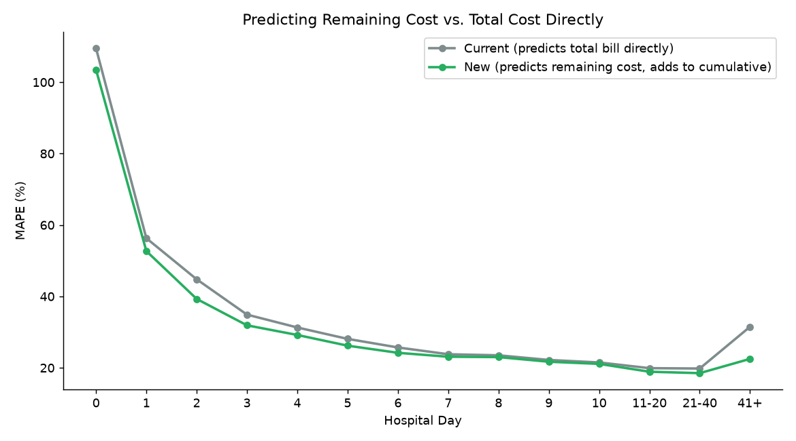
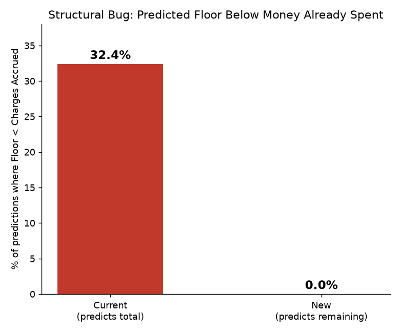
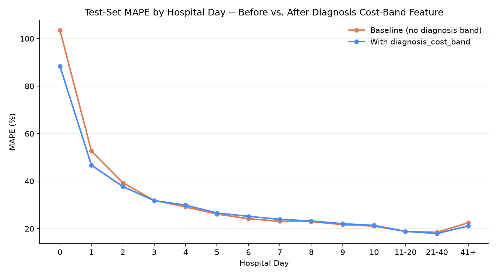
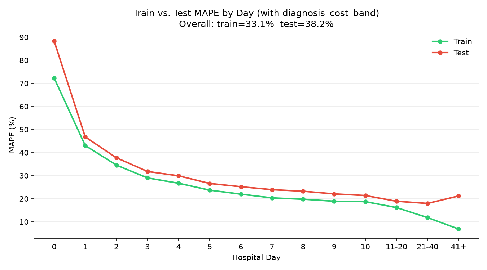
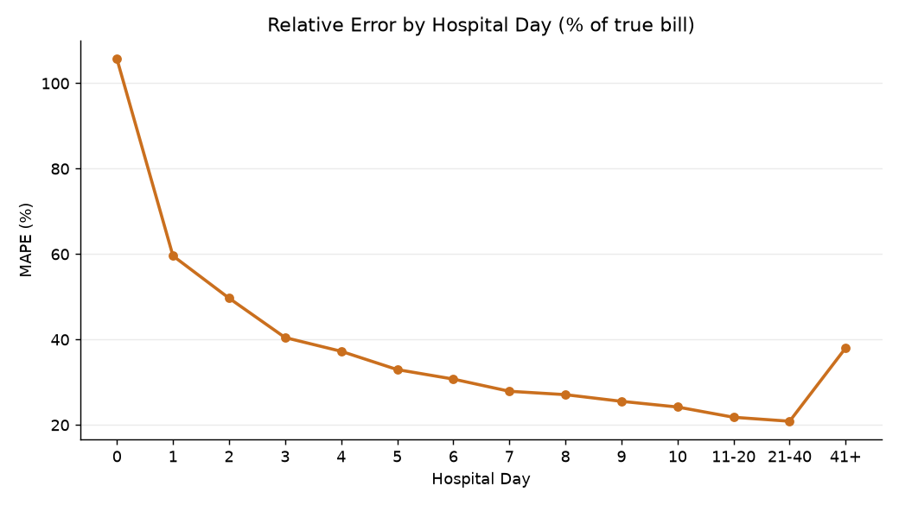
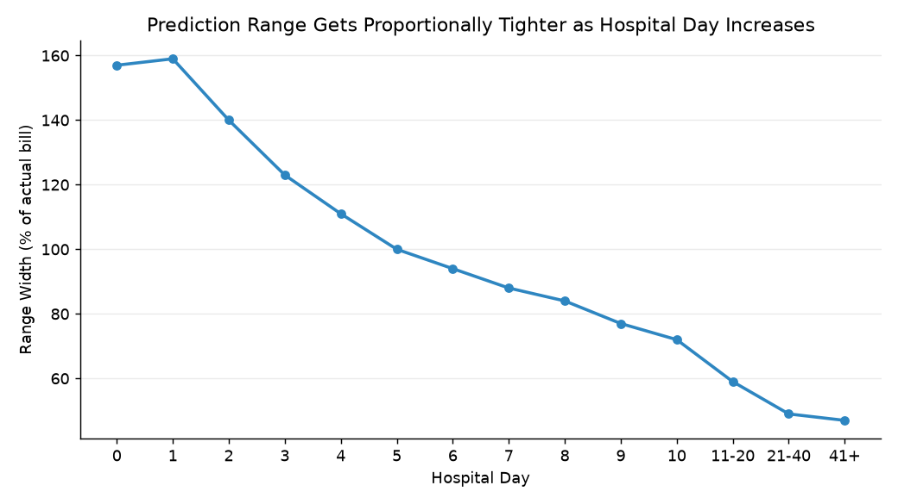

# Foqal CareOS

**A clinical AI platform that writes verified hospital discharge summaries and predicts patient cost day-by-day — running on real MIMIC-IV data.**


Foqal CareOS is an integrated hospital platform built on FastAPI + Google Cloud SQL (PostgreSQL), ingesting real de-identified EHR data from **MIMIC-IV** via BigQuery. It ships three clinical products on one shared patient database:

| Module | What it does |
| :--- | :--- |
| **Discharge Summary AI** | A 3-pass LLM pipeline that generates a 15-section NABH-compliant discharge summary, then independently audits every section against its own authorised sources. |
| **Cost Prediction ML** | XGBoost quantile regression (P10/P50/P90) predicting *remaining* hospital cost for each day of a stay, served live into the billing workflow. |
| **EWS Ward Monitor** | Real-time NEWS2 vitals scoring, drug–lab interaction alerts and nurse escalation workflows across CCU and general wards. |

---

## Why this is more than a CRUD app

**The discharge summary pipeline doesn't let the AI grade its own homework.**
Pass 1 flattens messy EHR rows (notes, labs, vitals, procedures, meds) into strict clinical JSON, cached per admission. Pass 2 streams the 15 sections. Pass 3 verifies each section against **only the source fields that section was allowed to use** — the Discharge Medications section is checked against the medication list and nothing else. That isolation is what turns *"this lab value isn't in the source"* into a reliable signal instead of a model agreeing with itself.

Findings land in a **tiered safety gate**:

| Tier | Catches | Consequence |
| :--- | :--- | :--- |
| **T1** | Formatting / structural issues | Advisory |
| **T2** | Medication errors — wrong drug, dose, frequency | Advisory, highlighted inline |
| **T3** | Hallucinated labs & vitals, contradicted diagnoses, missed allergies | **Hard-blocks doctor sign-off until resolved** |

Sign-off is backed by digital signature capture (MCI number, designation, signature image), version history, an amendment trail and full audit logging.

**The cost model predicts what's left, not what it all costs.**
Predicting the *total* bill produced a 32.4% floor-violation rate — the model's P10 came in below money the hospital had already billed, which is worse than useless at a billing desk. Reframing the target to *remaining* cost drove that rate **to zero by construction**, and was the single largest accuracy win on its own (46.1% → 41.3% MAPE).

Trained on **7,077 admissions / 46,145 day-wise rows / 63 engineered features**, split by admission ID so no stay straddles train and test.

| Metric | Before | After |
| :--- | ---: | ---: |
| Held-out test MAPE (overall) | 47.3% | **41.3%** |
| Train / test gap | 38.4% / 47.3% | **35.4% / 41.3%** |
| Day-0 MAPE | 103.5% | **88.4%** |
| Floor violations (P10 below already-billed) | 32.4% | **0%** |

The narrowed train/test gap is the number worth reading twice — accuracy improved while the gap *shrank*, so the model generalised rather than memorised. Predictions also sharpen roughly **4× over the course of a stay**: ≈103% MAPE at admission, when almost nothing is known, tightening to ≈21% by day 10 as the record fills in.

Day-0 accuracy specifically came from a shrinkage-based **diagnosis cost-band** feature. The cohort has 1,317 distinct diagnoses but only ~15 earned their own one-hot column; the other 1,302 fell into an `Other` bucket carrying zero signal. Bucketing by *cost* instead of frequency fixes that — but 54% of diagnoses have a single admission behind their average, so raw means are noise. Shrinkage toward the population mean (tuned k=10 → k=3 after k=10 collapsed the Mid-Low band) makes the feature stable without flattening the separation it exists to create. It sits on diagnosis rather than procedures deliberately: procedures can occur on any day of a stay, so a Day-0 model using them would leak future information, whereas diagnosis is legitimately known at admission.

---

## Results

Every chart below is regenerated from `cost_ml_model/` — see `evaluate_models.py`, `evaluate_train_vs_test.py` and `eval_with_band_full.py`.

| | |
| :---: | :---: |
|  |  |
| **Remaining vs total cost as target** — the reframing that drove 46.1% → 41.3% MAPE | **Floor violations** — P10 falling below already-billed money, 32.4% → 0% |
|  |  |
| **Diagnosis cost-band feature** — Day-0 MAPE 103.5% → 88.4% | **Train vs test by day** — accuracy up while the gap narrows, so it generalises |
|  |  |
| **Sharpening across a stay** — ≈103% MAPE at admission → ≈21% by day 10 | **P10–P90 interval width** — the quoted range tightens as the record fills in |

Further plots — per-day calibration, SHAP vs gain feature importance, LOS sub-model variants and the Day-0 A/B experiments — live in `cost_ml_model/eval_charts/`.

---

## Architecture

```
                        ┌──────────────────────────┐
   MIMIC-IV (BigQuery)  │  Google Cloud SQL        │
        │               │  PostgreSQL · 26 tables  │
        │  ETL          │  27 versioned migrations │
        └──────────────▶│                          │
                        └────────────┬─────────────┘
                                     │
            ┌────────────────────────┼────────────────────────┐
            │                        │                        │
     ┌──────▼──────┐          ┌──────▼──────┐          ┌──────▼──────┐
     │  Main API   │          │ Data Server │          │  Ward API   │
     │   :6017     │          │    :6020    │          │   :6030     │
     │             │          │             │          │             │
     │ LLM pipeline│          │ Bulk EHR    │          │ NEWS2 +     │
     │ Cost model  │          │ reads       │          │ escalations │
     └──────┬──────┘          └──────┬──────┘          └──────┬──────┘
            │                        │                        │
     ┌──────▼────────────────────────▼──────┐          ┌──────▼──────┐
     │      Main Frontend  ·  Vite :6001    │          │ Ward Monitor│
     │  doctor queue · review · sign-off    │─ login ─▶│  Vite :6040 │
     │  billing · CMO · admin dashboards    │  routes  │             │
     └──────────────────────────────────────┘          └─────────────┘
```

**Stack**

- **Backend** — FastAPI (async), SQLAlchemy, Cloud SQL Python Connector (pg8000)
- **Database** — Google Cloud SQL (PostgreSQL), 26 normalised tables, 27 versioned SQL migrations, composite indexing for high-frequency vitals telemetry
- **Data** — BigQuery ETL from MIMIC-IV; DuckDB + pandas for offline dataset builds
- **ML** — XGBoost quantile regression, scikit-learn, Elixhauser comorbidity features
- **AI** — Google Gemini (`google-genai`) for the summary pipeline; MedCPT embeddings + Qdrant for clinical retrieval
- **Frontend** — Vanilla JS + Vite, component-driven screens, no framework
- **Auth** — Role-based access control with bcrypt hashing

---

## Getting started

### Prerequisites

- Python 3.11+
- Node.js 20+
- A GCP service account with Cloud SQL + BigQuery access
- Access to the Foqal Cloud SQL instance
- `screen` (the deploy script runs each service in its own session)

### 1. Secrets

Nothing secret is committed. Create `.env.secrets` in the repo root — `deploy.sh` sources it and exports every variable to the services it starts:

```bash
CLOUD_SQL_PASS=<cloud sql password>
GOOGLE_APPLICATION_CREDENTIALS=<path to service account json>
GEMINI_API_KEY=<gemini api key>
```

> Without `CLOUD_SQL_PASS` exported the backends will crash-loop on startup.

### 2. Deploy

```bash
git clone https://github.com/sabarikrishna2006/Ward-Monitor.git
cd Ward-Monitor
bash deploy.sh
```

`deploy.sh` builds both virtualenvs, installs Python and npm deps, kills stale `screen` sessions and starts all five services with crash-restart loops.

| Service | Port | URL |
| :--- | :--- | :--- |
| Main app (login) | 6001 | `http://localhost:6001/` |
| Main API docs | 6017 | `http://localhost:6017/docs` |
| Data server docs | 6020 | `http://localhost:6020/docs` |
| Ward Monitor API docs | 6030 | `http://localhost:6030/docs` |
| Ward Monitor app | 6040 | `http://localhost:6040/` |

Ports live in **one place** — `frontend/config.js`. Change them there, not in individual HTML files.

```bash
screen -ls                  # list running services
screen -r main              # attach to main API logs
screen -r ward-api          # attach to ward monitor logs
```

### 3. Seed demo data

The synthetic CCU patients drive the drug–lab interaction engine and NEWS2 escalation trajectories:

```bash
source .venv/bin/activate
python clear_all_patients.py   # clears synthetic patients, leaves MIMIC data intact
python seed_demo_ccu.py        # seeds 6 demo CCU patients (IDs 91001–91006)
```

This generates 12 hours of continuous vitals, labs and medications engineered to trip specific clinical alerts (e.g. Amiodarone + hypokalaemia).

---

## Demo accounts

Log in at the main app; nurse roles are redirected straight into the Ward Monitor.

| Role | Username | Access |
| :--- | :--- | :--- |
| Ward Nurse | `rekha.devi@foqal.in` | Monitor CCU vitals, escalate deteriorating patients |
| Charge Nurse | `leena.kurup@foqal.in` | Review escalations, manage step-down transfers, override drug–lab flags |
| GW Nurse | `prathima.m@foqal.in` | Acknowledge step-down transfers in the general ward |
| Resident Doctor | `dr.anand@foqal.in` | Clinical oversight, discharge summary review and sign-off |

> Passwords for these seeded demo accounts are set by migration `015_unified_staff_auth.sql` and upgraded from plain text to bcrypt on first login. They are **demo credentials on synthetic data** — not valid anywhere else.

---

## Repository layout

```text
.
├── backend/
│   ├── app/
│   │   ├── main.py                  # Main API — summaries, auth, workflow
│   │   ├── data_server.py           # Bulk EHR read API
│   │   ├── cost_predictor.py        # Serves the XGBoost quantile model
│   │   ├── live_feature_builder.py  # Builds model features from Cloud SQL in real time
│   │   ├── bigquery_mimic_loader.py # MIMIC-IV → Cloud SQL ETL
│   │   ├── embedder.py / qdrant_store.py / chunker.py   # MedCPT retrieval
│   │   └── migrations/              # 27 versioned SQL migrations
│   ├── apply_migration.py
│   └── cloud_sql_schema.sql
│
├── frontend/
│   ├── config.js                    # Single source of truth for ports
│   ├── screens/
│   │   ├── doctor-queue.js          # Patients awaiting summaries
│   │   ├── doctor-dashboard.js      # Assembled clinical record
│   │   ├── review-v2.js             # Section-by-section AI review + T1/T2/T3 flags
│   │   ├── signoff.js               # Sign-off, blocked until T3 flags clear
│   │   ├── signed.js                # Signed summary + signature
│   │   ├── amendment.js             # Post-sign-off amendment trail
│   │   └── rejection-flow.js
│   └── billing.html · cmo.html · admin-dashboard.html · dashboard.html
│
├── cost_ml_model/
│   ├── pull_dcm_admissions.py            # Cohort extraction
│   ├── build_day_wise_dataset.py         # 46,145 day-wise rows
│   ├── add_diagnosis_cost_band_feature.py# Shrinkage cost bands
│   ├── validate_shrinkage.py             # k-tuning validation
│   ├── train_baseline_and_xgboost.py     # Quantile training
│   ├── retrain_with_diagnosis_band.py
│   ├── evaluate_models.py · evaluate_train_vs_test.py
│   ├── models/                           # Trained artefacts
│   └── eval_charts/ · eda_charts/        # Accuracy and calibration plots
│
├── sabari_project/                  # EWS Ward Monitor (separate module)
│   ├── backend/
│   │   ├── main.py · mimic_sync.py
│   │   ├── engine/ · rules/         # NEWS2 scoring + escalation rules
│   │   └── ews_migration.sql
│   └── app.js · index.html
│
├── notebooks/                       # EDA and model exploration
├── deploy.sh                        # Unified deploy — starts all five services
├── seed_demo_ccu.py                 # Synthetic CCU patient generator
└── requirements.txt
```

---

## Data & licensing

Patient data comes from **MIMIC-IV**, a de-identified public research dataset governed by a PhysioNet Data Use Agreement. Row-level derived data is **not** committed to this repository (`cost_ml_model/data/` is gitignored) and must not be redistributed via git regardless of repository visibility. Regenerate it locally with the `cost_ml_model/` build scripts once you have your own PhysioNet credentialed access.

The system runs on MIMIC-IV plus synthetic demo patients. It has **not** been deployed in a live hospital with real patients.

Code is licensed under the MIT License — see [LICENSE](LICENSE).
